# Monocular Visual Odometry

This project serves as a simple implementation of monocular visual odometry algorithm, where multiple methods will be compared, including feature detection, matching, scale estimation, optimization, and hardware implementation.

Overall Pipeline:
1. Detect features and descriptors in first image and second image
2. Match features
3. Compute essential matrix using 5-point algorithm from matched features
4. Decompose essential matrix to get rotation R and unit translation t
5. Use triangulation on matched features to estimate 3D points
6. Estimate relative scale between 2 transform by comparing 2 sets of 3D points. This requires at least 3 frames to form 2 sets of 3D points
7. Get current camera pose by concatenating previous pose with recovered relative transformation with scale

### SIFT vs ORB
Comparison between different feature detection methods, using scale-invariant feature transform (SIFT) vs Oriented FAST and Rotated BRIEF (ORB). The result show SIFT vs ORB for feature detection and using feature matching on kitti seq 05 for 1000 frames. 

Left SIFT (121.994 seconds), Right ORB (52.6226 seconds)

<table>
  <tr>
    <td align="center">
      <b>SIFT</b> 
      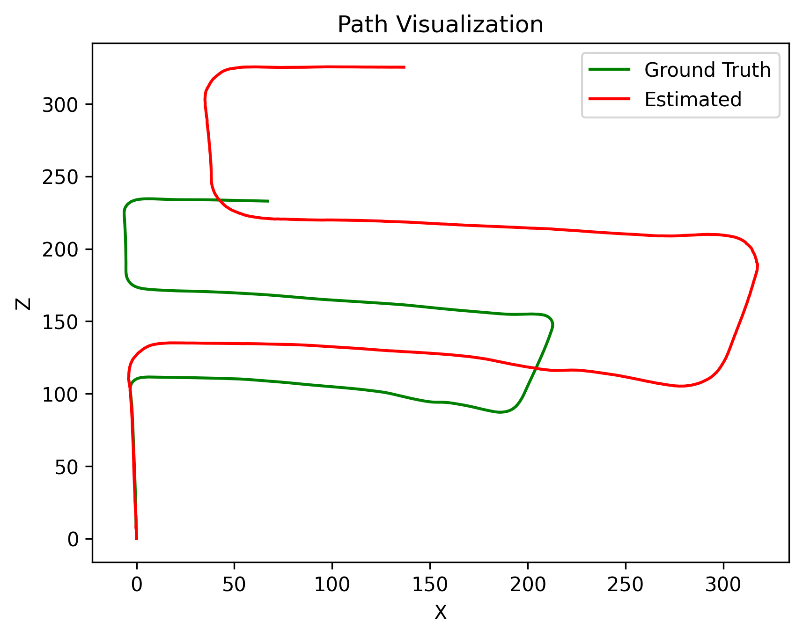
    </td>
    <td align="center">
      <b>ORB</b> 
      
    </td>
  </tr>
  <tr>
    <td align="center">
      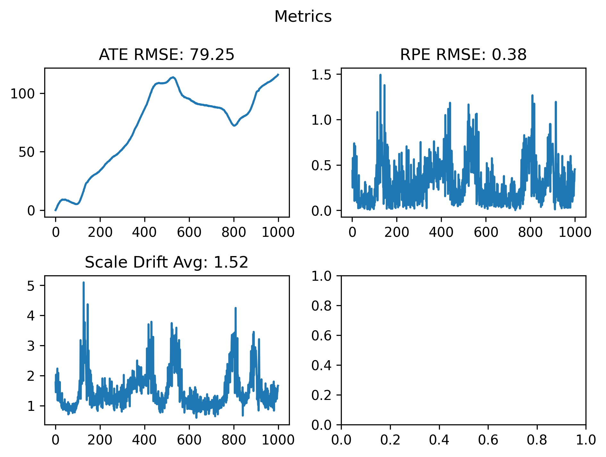
    </td>
    <td align="center">
      
    </td>
  </tr>
</table>

### Matching vs Tracking
Comparison between feature association methods, using flann knn matching vs optical flow tracking. The result show matching vs tracking for ORB feature detection on kitti seq 05 for 1000 frames.

Left matching (52.6226 seconds), Right tracking (13.8782 seconds)

<table>
  <tr>
    <td align="center">
      <b>Matching</b> 
      
    </td>
    <td align="center">
      <b>Tracking</b> 
      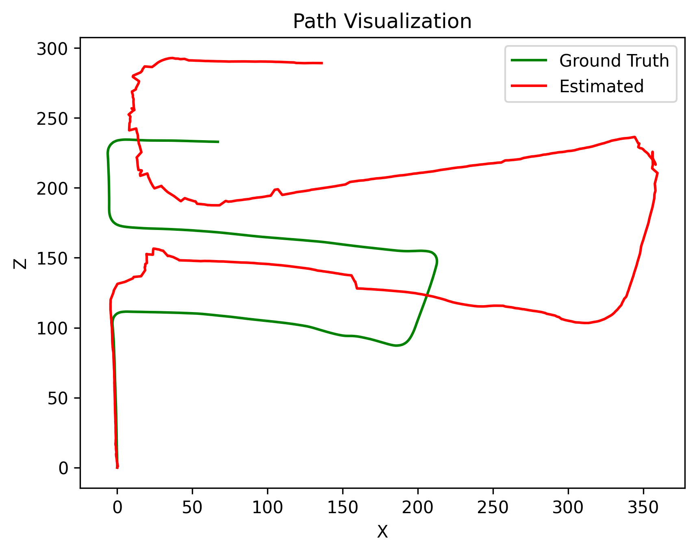
    </td>
  </tr>
  <tr>
    <td align="center">
      
    </td>
    <td align="center">
      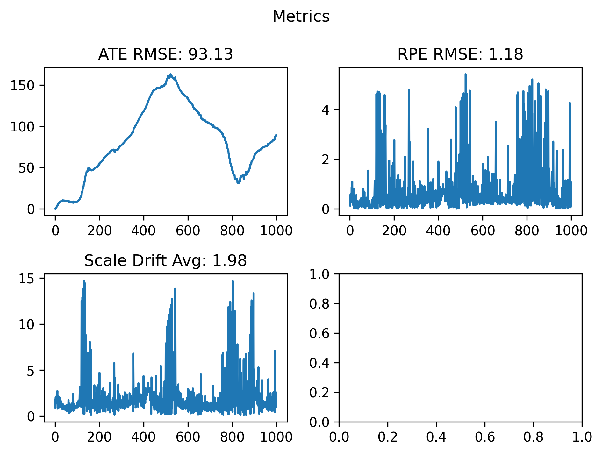
    </td>
  </tr>
</table>

### Scale estimation using matched vs unmatched 3D points
Comparison between matching the 3D points produced from frame t-2, t-1 and t-1, t vs not matching the 3D points. In theory, we should definitely match the 3D points to compute accurate scale. But in practice, the distance between falsely matched points when no matching is done balanced each other out, so the overall scale remains the same. The result show matched vs unmatched for 3D points using ORB feature matching on kitti seq 05 for 1000 frames. Only this set of result were ran in python, while others ran in c++.

Left matched (69.8625 seconds), Right unmatched (50.7254 seconds)

<table>
  <tr>
    <td align="center">
      <b>Matched</b> 
      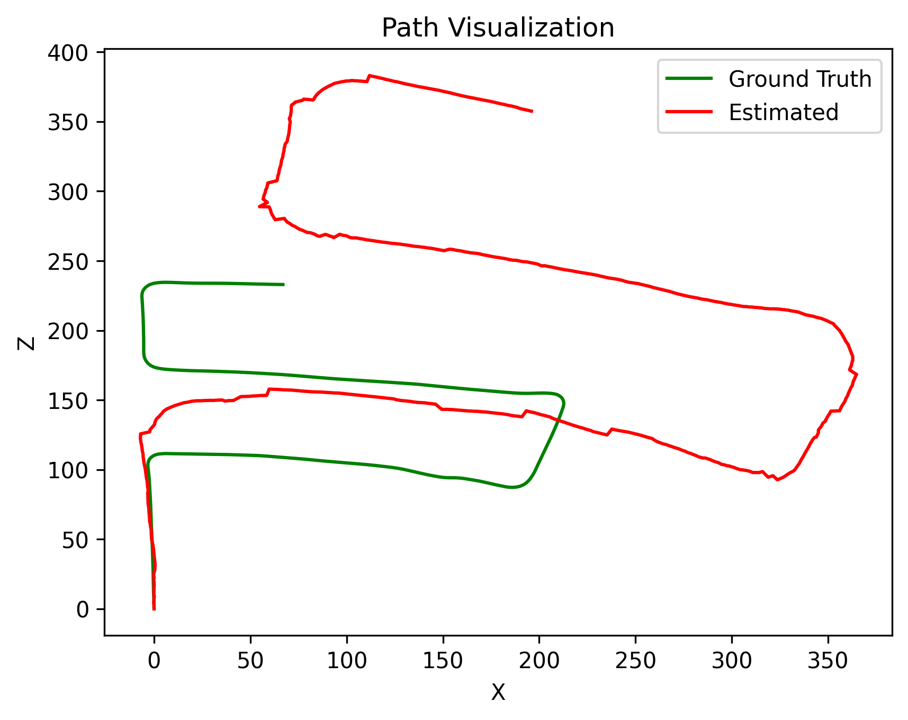
    </td>
    <td align="center">
      <b>Unmatched</b> 
      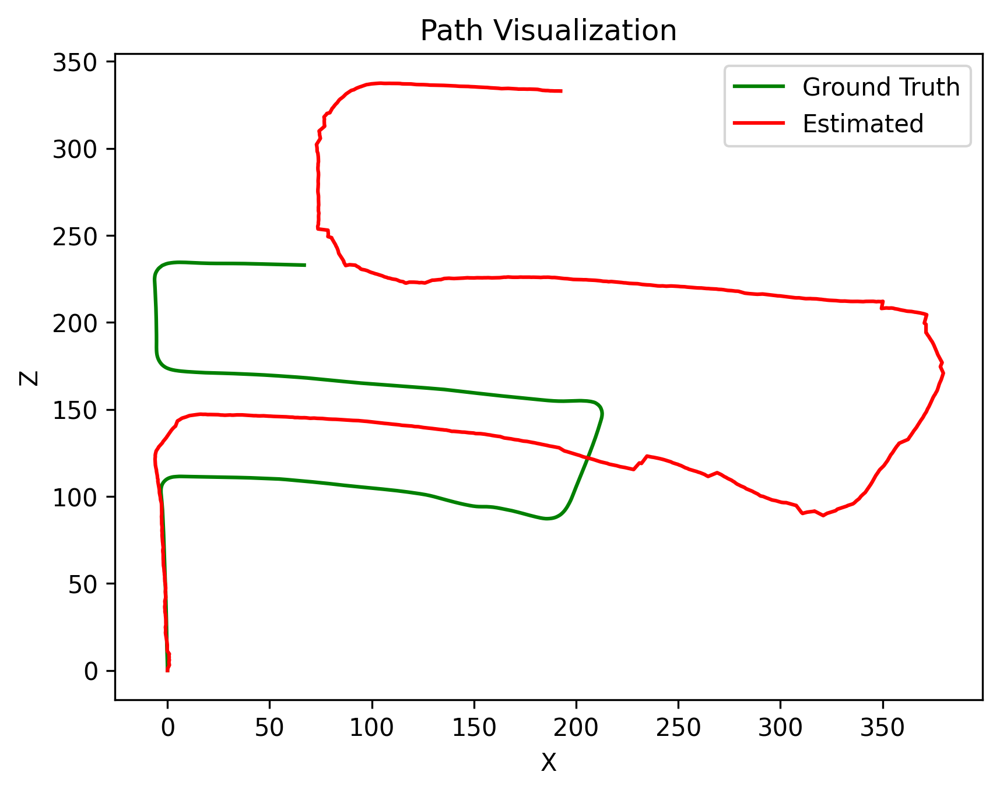
    </td>
  </tr>
  <tr>
    <td align="center">
      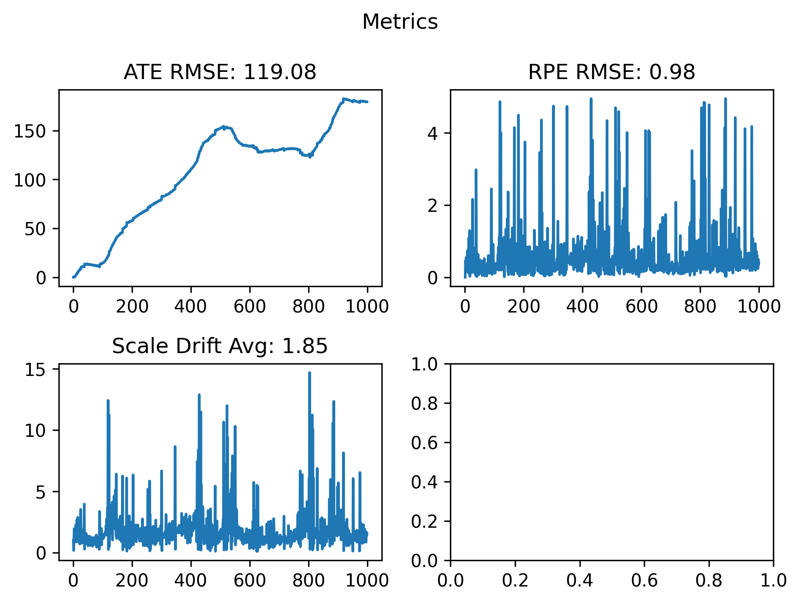
    </td>
    <td align="center">
      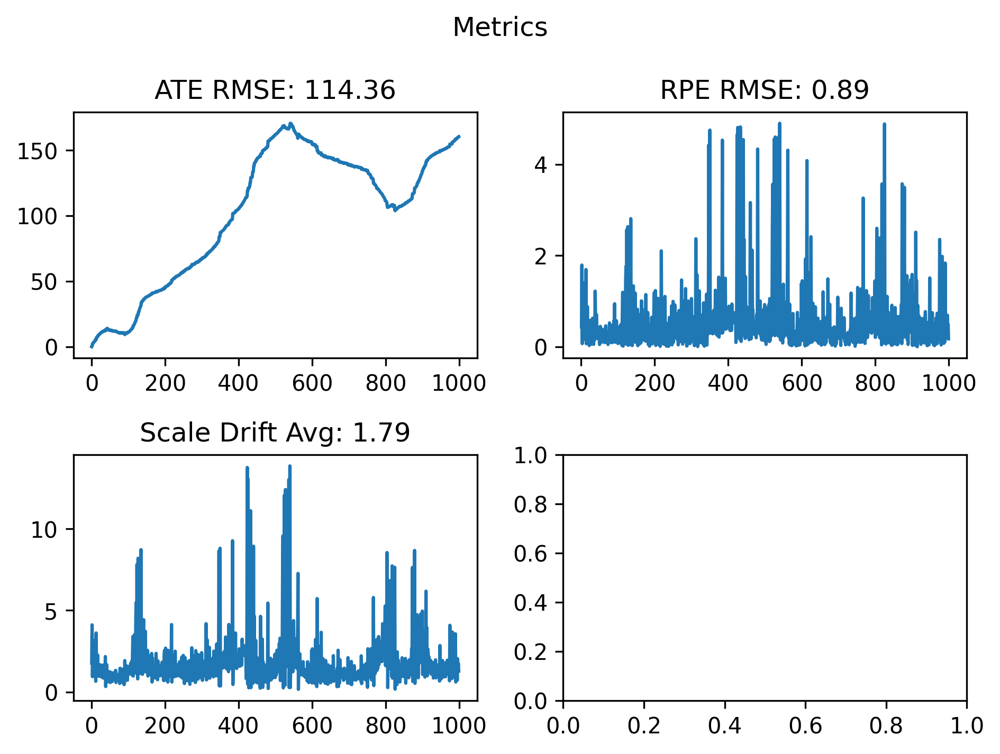
    </td>
  </tr>
</table>

### Local Windowed Bundle Adjustment
Comparison between optimization via bundle adjustment vs no optimization. The result shows bundle adjustment vs no bundle adjustment for SIFT feature tracking on kitti seq 05 for 1000 frames.

Left with bundle adjustment (216.41 seconds), Right without bundle adjustment (16.4911 seconds)

<table>
  <tr>
    <td align="center">
      <b>With bundle adjustment</b> 
      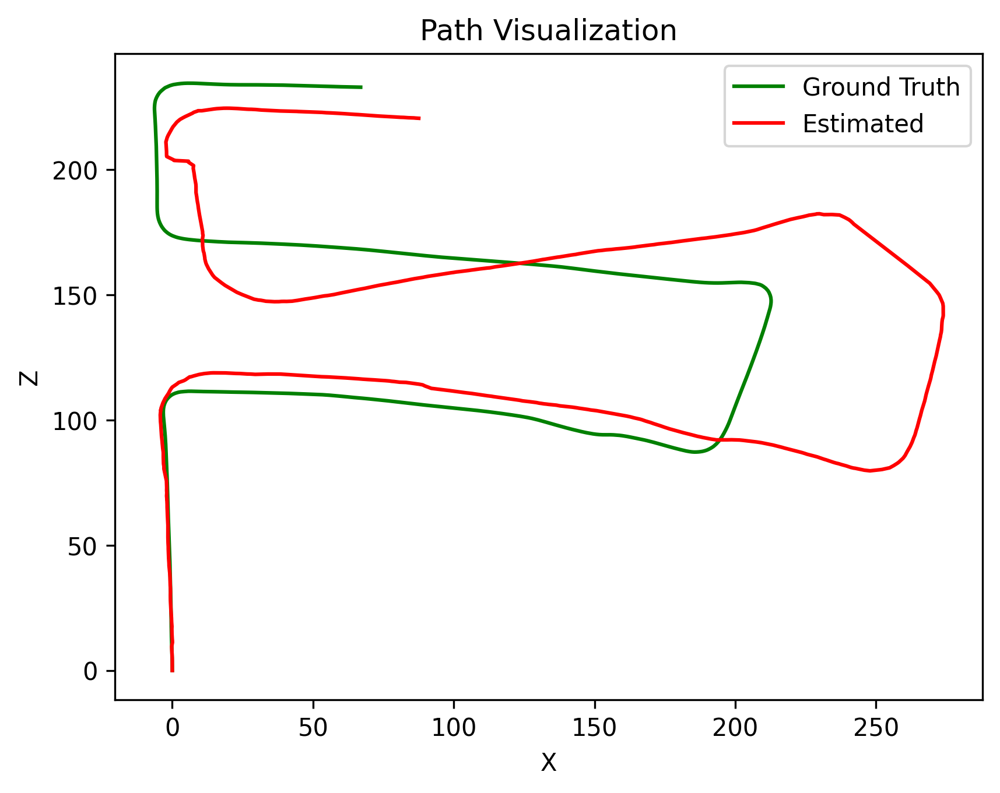
    </td>
    <td align="center">
      <b>Without bundle adjustment</b> 
      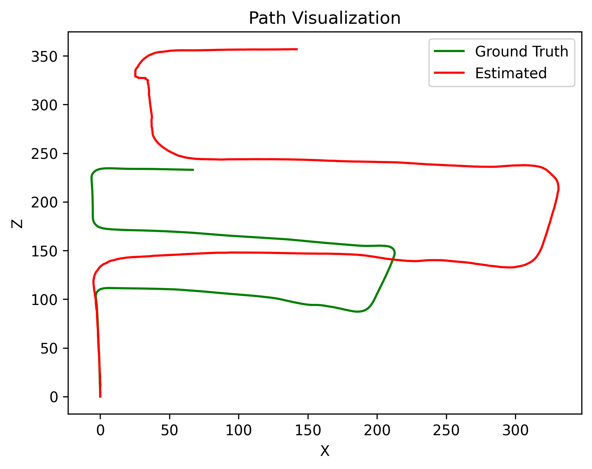
    </td>
  </tr>
  <tr>
    <td align="center">
      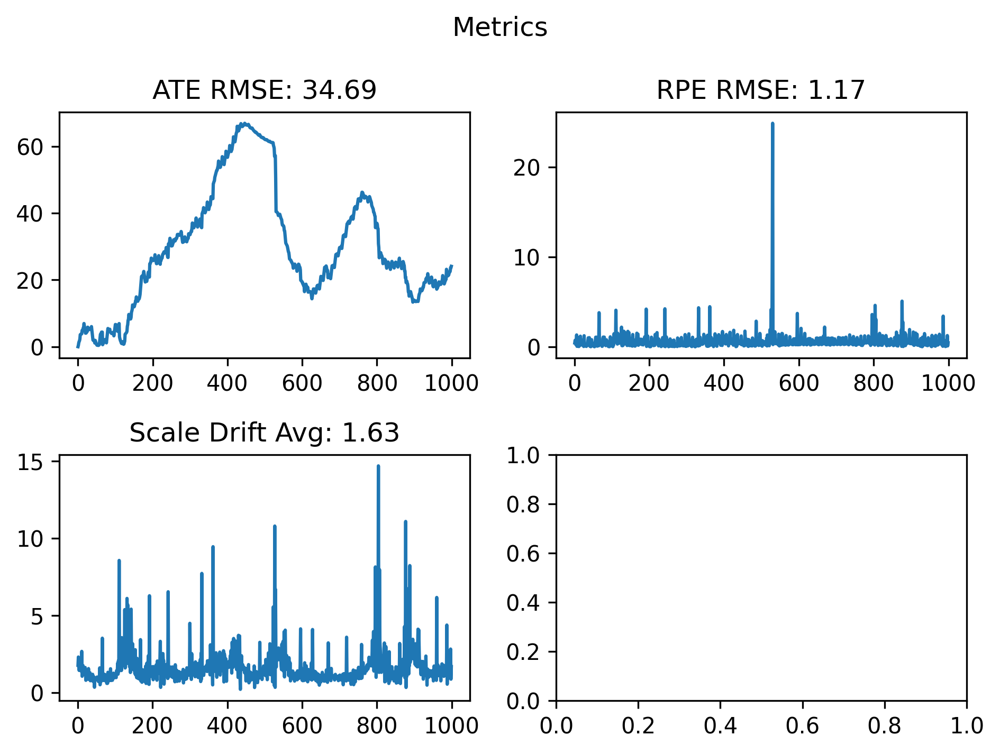
    </td>
    <td align="center">
      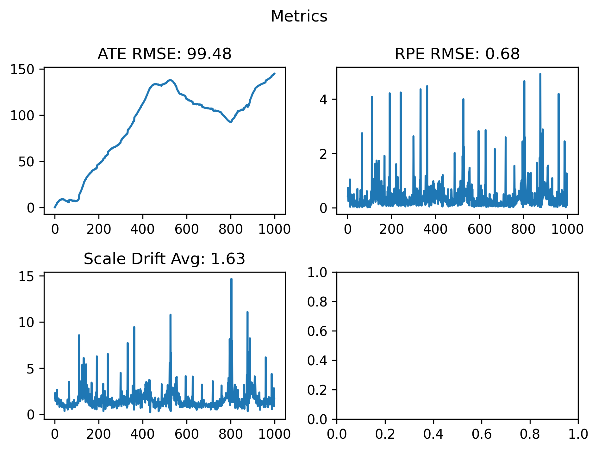
    </td>
  </tr>
</table>

### CPU vs GPU